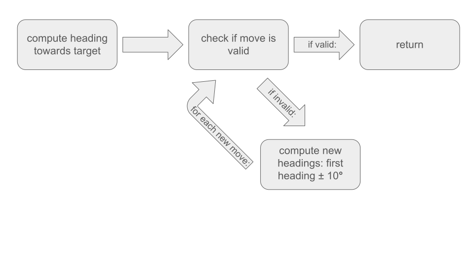
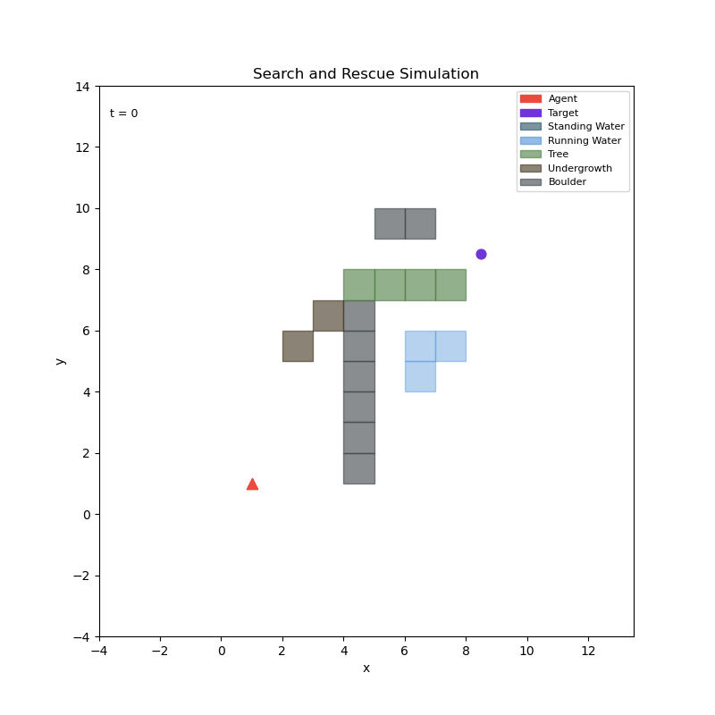
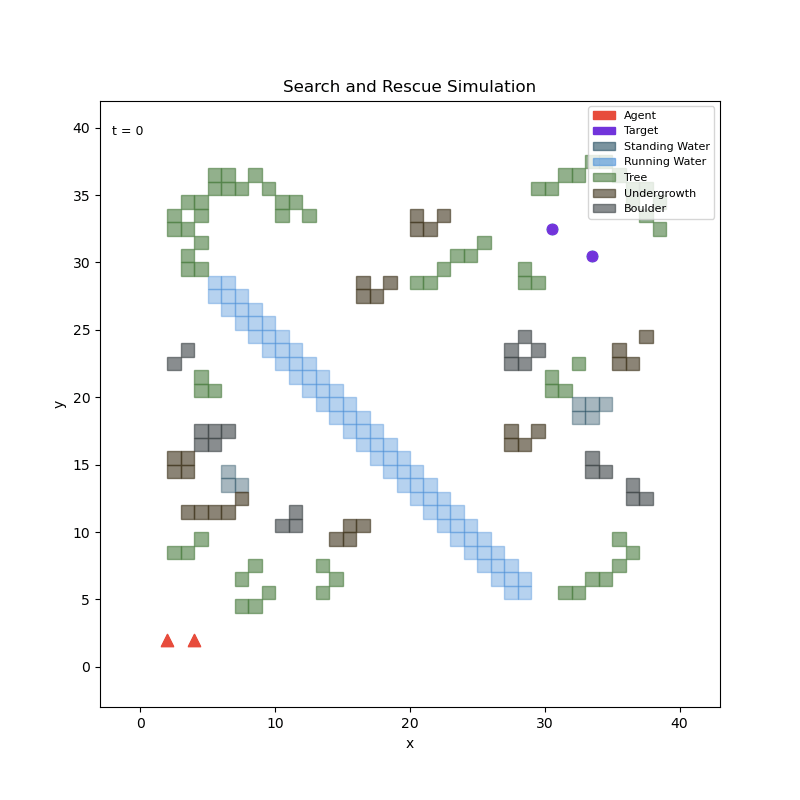
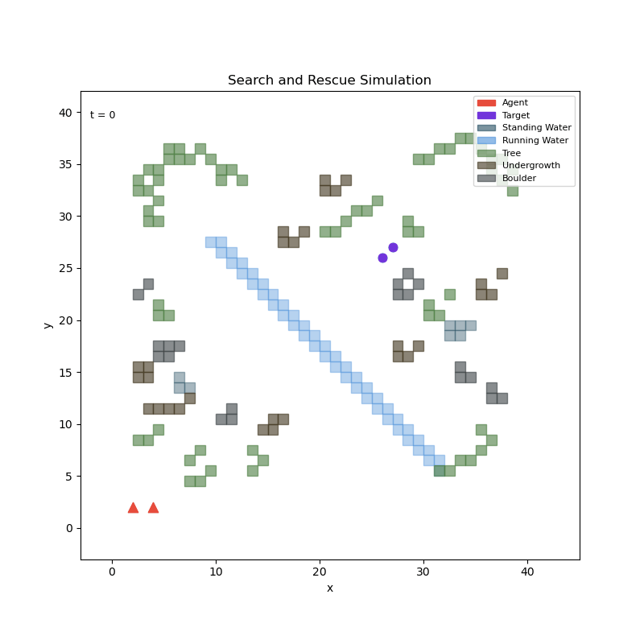

# WiSAR-Simulator-513
This codebase's purpose is to create a _Wilderness Search and Rescue_ simulator with configurable scenarios, modeling a dynamic system of an agent searching for a target (that could be static or dynamic as well). We hope to be able to study how to model dynamics as an optimization problem in which we try to optimally choose where to go/search for a target in the face of uncertainty.

The public repository of this codebase can be found [here](https://github.com/blakenp/WiSAR-Simulator-513).

### What This Code Is

This simulator was written as a class project for CS 513 at BYU. As such, it is fairly limited in scope, and therefore in usefulness to people other than its authors. Our primary goal in writing the simulator was to gain a deeper understanding of how such a piece of software should be structured, and of some of the harder questions that would need to be answered.

### What This Code Is Not

Complete. We had limited time to complete the project, and were not able to implement all of the features we would have liked. There are also some design decisions we made early on that may not have been the best option; for instance, our implementation of environmental hazards ended up being very fiddly and difficult to work with.

Incompleteness in mind, we did do our best to make the software relatively easy to extend. Everything is written from an object-oriented perspective, with abstract base classes for specific types of search agents or targets to implement. This means that it should be relatively straightforward, if desired, to add an agent which implements some new type of search algorithm.

With all of that said, if you are looking for a robust piece of software to run simulations on, this is probably not it. You might investigate [BYU FROST Lab's ocean search and rescue simulator](https://frostlab.byu.edu/research/HoloOcean-Underwater-Simulator/), for example. Regardless, hopefully our work can provide some insight into how such a simulator might work.

## How To Run
To run a simulation, you simply run the following command from the root directory of the codebase:

```bash
python -m search_sim example_config.yaml
```

We created a `SimulatorConfigParser` that reads in and parses the yaml config files. The parsed config is then passed through a _builder_ layer that acts as an adapter between the config file and the codebase data objects we defined here. That is, the builder constructs agents, targets, the environment, belief maps, etc. as specified in the config and then instantiates the final `Simulator` object that holds these entities in its state.

The final results of the simulation will be saved in the finished_runs directory as e.g. example_config_agents.csv, example_config_targets.csv, and example_config_hazards.csv. These CSV files record the (x,y) positions of each entity at each timestep, in addition to some other identifying information.

### Generating animations

From the root directory, run

```bash
python animate.py --agents [config_name]_agents.csv --targets [config_name]_targets.csv --hazards [config_name]_hazards.csv --output [filename].gif
```

The animate script assumes the simulation CSVs are in the finished_runs directory; if they aren't, it won't work.

You can optionally specify the frames per second of the animation with the ```--fps``` flag, and you can specify the time delay between frames with the ```--interval``` flag.

## Simulator

The simulator's main responsibility in our codebase is to be the orchestrator of the physics and interaction of entities in our code. At each timestep and for each agent and target in the simulation, it queries the desired action, creates a new state object to describe the results of that action, and then updates the state of the entity in question. Each agent/target has a function that outputs its next desired action, as well as a function to update the state. Therefore, all of the dynamics of the model happen in the simulator, rather than having each entity compute its own dynamics with something like a `move` function.

This approach helps eliminate "race conditions" where one agent might react to another’s movement within the same frame. This allowed us to more easily construct snapshots of the simulator state at each step of the simulation, and to iteratively handle each entity's dynamics iteratively and synchronously. 

Below, we dive deeper into some more of our strategies for organizing our code and making it flexible for adding different types of targets and agents without having to add or change too many existing files.

## Code structure

We have several modules that work together to simulate the behavior of the entire system. While there are some important differences in how each module is implemented, there are some significant similarities as well. Most instances of a given module maintain a state vector, which contains all the information needed to compute the next step taken by the module. We also have custom types, factory methods, and so forth for each module.

### Entities

The `Entity` class is the abstract base class underpinning agents, targets, and hazards. It allows for querying its unique identifier, its location, and updating its state. It also allows its children to have state vectors.

#### State vectors

The state vector varies in what it contains depending on what kind of entity it belongs to. Hazard state vectors are very simple and contain position, identifier, and hazard type. Agent and target state vectors are much more complex and contain things like current speed, maximum speed, a list of which kinds of hazards are traversable by that particular entity, etc. Many elements of a state vector (such as the traversable hazards list) will not be updated at all as the simulation runs, but are only set at initialization by the config file.

### Agents

The abstract class `Agent` is one implementation of the `Entity` class. We have two finished agent behavior implementations. The first behavior we have implemented is a "direct path finder" agent which knows the initial position of a target and attempts to travel in a straight line to that point. If it encounters a hazard which it cannot navigate through, or any other obstruction to its straight line travel, it will attempt to navigate around it by checking directions progressively further away from the straight line. This algorithm is illustrated graphically in the figure below.



The behavior of our direct path agent is simply modeling a [Dubins Vehicle](https://en.wikipedia.org/wiki/Dubins_path). What this means is that our agent is pretty simple in the sense that it has a dynamical function for updating its position ($\dot{x}, \dot{y}$) and that it also has some heading that can be adjusted $\dot{\theta}$ according to the agent's desired behavior.

The second agent we implemented is a Voronoi Bayes agent that uses _Markov Chain Monte Carlo_ sampling of possible hazard locations combined with Voronoi map generation to safely traverse through a scenario, avoiding obstacles and making it to the target. A Voronoi map/diagram is a geometric tessellation of Euclidean space, in which you have clusters with center points known as centroids that are enclosed by convex shapes. Voronoi maps for robot pathfinding [have been used previously in the literature](https://ieeexplore.ieee.org/document/6631230) (as _Voronoi Uncertainty Fields_), but we implemented a more Bayesian approach.

The behavior of target finding is similar to the direct path agent in the fact that this agent also knows where the target is from the beginning, but doesn't know where the hazards are and must use simulated noisy sensors applying ray casting to update its belief about the environment and safely find a path to the target. Below is an illustration of the algorithm implemented.



### Targets

The abstract class `Target` is another implementation of the `Entity` class. We have implemented four target behaviors: static, evasive, random walking, and "intelligent":

- static targets stay stationary, in the position they were initialized in
- evasive targets avoid agents and seek hazards
- random walking targets pick a random direction and a random speed at each timestep
- intelligent targets avoid hazards and move toward agents

Evasive and intelligent targets generate a list of potential actions to take, and score them based on their desired behavior. The highest-scoring action is the one the target ends up taking. Currently, evasive targets place equal weight on avoiding agents and moving towards hazards and intelligent targets place equal weight on moving towards agents and avoiding hazards, but these weights could be adjusted to get slightly different behavior.

### Hazards

We have implemented five hazard types:

- running water
- standing water
- tree
- undergrowth
- boulder

These hazards are functionally identical in that they only store a position. If agents and targets are not programmed with any traversable hazards in their state vectors, then they will regard every hazard as a wall. Therefore, hazards can only produce truly interesting dynamics if agents and targets are given varying ability to navigate different hazards. For example, if the target being simulated is a person, it might be safe to assume that they can swim and therefore navigate any water hazards. But if the agent being simulated is some sort of ground-based robot, it would not be able to swim. This difference between the agent and the target could produce interesting dynamics, especially if the target is trying to evade the agent.

As constructed, we assume a hazard occupies an entire cell in the environment. Therefore, if you wish to have something like a river running through your simulated environment, you must place hazards for each cell that the river touches.

### World

The primary structure of this module is a 2D array of nodes. Each node stores a set that contains all of the entities in the cell.

## Example Simulation Animations

Below are a few example animations of simulations that were run on our software. If the animations aren't rendering properly, please use the link at the top of the README to navigate to the Github repository, where they should be visible.

### Direct Path Agent Results

#### Small environment, single evasive target



A single target running away from a single agent. The agent is faster than the target, and so is able to catch up. In this simulation, the direct path agent's ability to find *a* possible move, even if it's not on the direct line toward the target, is demonstrated.

#### Larger environment, two evasive targets



Two targets evading two agents. The agents are unable to cross the river and so get stuck. It's not completely clear why this happens, but it's due to some interplay between the desire to go straight toward the targets, the inability to cross the river, and the ability to find *a* move&mdash;somehow, the end result is that the agents keep stepping away from and then back towards the river indefinitely.

#### Larger environment, two intelligent targets



Two targets trying to be found by two agents. The agents are again unable to cross the river for the same reasons as above. The targets' awareness radii are big enough that the target which moves toward the river is able to "see" the agents and attempt to reach them, but the simulation never quite terminates. We believe the target's move scoring algorithm reaches some sort of equilibrium between wanting to move toward the agents and not wanting to be more surrounded by hazards *just* before the simulation would otherwise terminate.

### Voronoi Bayes Agent

Below are some of the examples of simulator results with the Voronoi Bayes Agent. The noisy shapes visible at each time step are the edges of the Voronoi map that is generated. Additionally, there are twelve _MCMC_ samples each timestep, which introduces some variance.

#### Small and Simple Environment, Single Agent


As we can see, the sensor readings are pretty noisy but overall do a decent job at enclosing hazards. However, the edges sometimes explode off into infinity, which can happen with Voronoi diagram generation. So for future simulations we enclose the Voronoi diagram and pad it using virtual Voronoi boundary centroids.

#### More, but Still Small Hazards, Single Agent


As we can see here, the agent does a good job avoiding obstacles and manages to reach the target in safety, despite sometimes getting stuck in small loops. You can see the agent occasionally following the ridges of the Voronoi map too closely, when cutting directly across a cell would have been more efficient (such as at the very end of the simulation), but the behavior is overall pretty good. Future research will have to be done to see how this would play out with a dynamic target. 

#### More and Bigger Hazards, Single Agent


There is a lot to unpack here, but to be brief, the agent still struggles a lot in environments with longer spanning hazards. It can usually eventually get to the target, but there were many times testing this same scenario with the same hyperparameters in which the agent would simply get stuck and never find the target. Thus, this agent is still very fragile in more complex environments, and more research needs to be done to discover more robust and intelligent reward signals to get the agent to still remain safe, but get stuck in fewer loops and therefore reach the target more quickly. It is likely that there is currently too much noise per time step, leading to ambiguity when choosing which edge of the Voronoi map to follow for safety. That is, when an edge jumps around significantly from one time step to another, the agent may be confused about where precisely to navigate. Smoothing across time steps could potentially help mitigate this problem.

## References

- [Wikipedia: Voronoi Diagrams](https://en.wikipedia.org/wiki/Voronoi_diagram)
- [Kyle Ok et al IEEE 2013 Path planning with uncertainty: Voronoi Uncertainty Fields](https://ieeexplore.ieee.org/document/6631230)
- [Wikipedia: Dubins Vehicle](https://en.wikipedia.org/wiki/Dubins_path)
- [BYU FROST Lab's ocean search and rescue simulator](https://frostlab.byu.edu/research/HoloOcean-Underwater-Simulator/)
